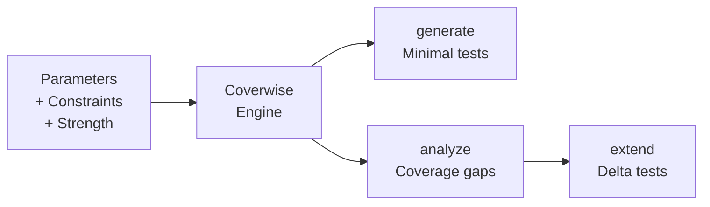

# coverwise

[](https://github.com/libraz/coverwise/actions)
[](https://codecov.io/gh/libraz/coverwise)
[](https://github.com/libraz/coverwise/blob/main/LICENSE)
[](https://en.cppreference.com/w/cpp/17)
[](https://github.com/libraz/coverwise)

A modern combinatorial testing engine for designing high-quality test suites with full coverage guarantees.

Generate, analyze, and evolve test cases — in browsers, Node.js, and native C++.

## Why Coverwise?

Most bugs come from unexpected interactions between components. Coverwise ensures those interactions are systematically covered.

- **Prove your test quality** — exact coverage metrics with every missing combination identified
- **Design better tests** — don't just generate, analyze existing suites and extend them incrementally
- **Works everywhere** — browser, CI, backend — zero native dependencies via WASM

For QA engineers, SDETs, and developers who need systematic coverage without combinatorial explosion.

## How It Works



## Quick Start

### JavaScript / TypeScript

```bash
npm install @libraz/coverwise
```

```typescript
import { Coverwise, when } from '@libraz/coverwise';

const cw = await Coverwise.create();

// Generate a minimal test suite with full pairwise coverage
const result = cw.generate({
  parameters: [
    { name: 'os',      values: ['Windows', 'macOS', 'Linux'] },
    { name: 'browser', values: ['Chrome', 'Firefox', 'Safari'] },
    { name: 'theme',   values: ['light', 'dark'] },
  ],
  constraints: [
    when('os').eq('Windows').then(when('browser').ne('Safari')).toString(),
  ],
});
console.log(result.tests);    // 10 tests, 100% coverage
console.log(result.uncovered); // [] — nothing missing

// Already have tests? Measure what they actually cover
const report = cw.analyzeCoverage(parameters, myExistingTests);
console.log(report.coverageRatio); // 0.72
console.log(report.uncovered);     // ["os=Linux, browser=Safari", ...]

// Fill only the gaps — no need to regenerate from scratch
const extended = cw.extendTests(myExistingTests, { parameters, constraints });
console.log(extended.tests.length - myExistingTests.length); // 3 new tests added
```

## What You Can Do

| Capability | Description |
|-----------|-------------|
| **Pairwise & t-wise** | 2-wise through arbitrary strength covering arrays |
| **Constraints** | `IF/THEN/ELSE`, `AND/OR/NOT`, relational (`<`, `>=`), `IN`, `LIKE` |
| **Negative testing** | Mark values as `invalid` to auto-generate single-fault negative tests |
| **Mixed strength** | Sub-models let critical parameter groups get higher coverage |
| **Boundary values** | Auto-expand integer/float ranges into boundary classes |
| **Equivalence classes** | Group values into classes and track class-level coverage |
| **Seed tests** | Build on existing tests instead of starting from scratch |
| **Weight hints** | Prefer specific values when coverage is otherwise equivalent |
| **Coverage analysis** | Validate any test suite's t-wise coverage independently |
| **Deterministic** | Same input + seed = identical output, every time |

## CLI

```bash
# Generate tests from a JSON spec
coverwise generate input.json > tests.json

# Analyze existing test coverage
coverwise analyze --params params.json --tests tests.json

# Extend existing tests
coverwise extend --existing tests.json input.json

# Preview model statistics
coverwise stats input.json
```

Exit codes: `0` OK, `1` constraint error, `2` insufficient coverage, `3` invalid input.

## Performance

All configurations achieve **100% t-wise coverage**, verified by an independent coverage validator. Test counts fall within known theoretical bounds from covering array research.

### Pairwise (2-wise) Generation

| Configuration | Params | Values | Tuples | Tests | Theoretical Min | Time |
|---------------|--------|--------|--------|-------|-----------------|------|
| 5 × 3 uniform | 5 | 3 | 90 | 16 | 9 (OA) | < 1 ms |
| 10 × 3 uniform | 10 | 3 | 405 | 20 | 9 (OA) | < 1 ms |
| 13 × 3 uniform | 13 | 3 | 702 | 21 | 9 (OA) | < 1 ms |
| 10 × 5 uniform | 10 | 5 | 1,125 | 52 | 25 | 1 ms |
| 15 × 4 uniform | 15 | 4 | 1,680 | 40 | 16 | 1 ms |
| 20 × 2 uniform | 20 | 2 | 760 | 12 | 4 | < 1 ms |
| 20 × 5 uniform | 20 | 5 | 4,750 | 66 | 25 | 4 ms |
| 30 × 5 uniform | 30 | 5 | 10,875 | 76 | 25 | 9 ms |
| 50 × 3 uniform | 50 | 3 | 11,025 | 33 | 9 (OA) | 6 ms |
| 5 × 20 high-card | 5 | 20 | 4,000 | 514 | 400 | 9 ms |
| 3⁴ × 2³ mixed | 7 | 2–3 | 138 | 14 | 9 | < 1 ms |
| 5¹ × 3³ × 2⁴ mixed | 8 | 2–5 | 208 | 19 | 15 | < 1 ms |

### Higher-Strength Generation

| Configuration | Params | Values | Strength | Tuples | Tests | Time |
|---------------|--------|--------|----------|--------|-------|------|
| 15 × 3 | 15 | 3 | 3-wise | 12,285 | 100 | 11 ms |
| 8 × 3 | 8 | 3 | 4-wise | 5,670 | 236 | 8 ms |

Measured on Apple M-series (seed=42). "Theoretical Min" refers to known lower bounds from orthogonal array (OA) theory or v² bounds. Greedy algorithms typically produce 1.5–2.5× the theoretical minimum — this is expected and consistent with published results for covering array generators.

## Build

```bash
# Native (C++)
make build            # Debug build
make test             # Run tests
make release          # Optimized build

# WebAssembly
make wasm             # Build WASM via Emscripten

# JavaScript
yarn build            # Build WASM + TypeScript
yarn test             # Run JS/WASM tests
```

## License

[Apache License 2.0](LICENSE)
