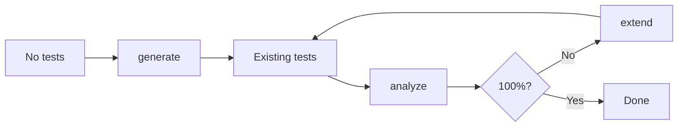

# coverwise

[](https://github.com/libraz/coverwise/actions)
[](https://codecov.io/gh/libraz/coverwise)
[](https://github.com/libraz/coverwise/blob/main/LICENSE)
[](https://en.cppreference.com/w/cpp/17)
[](https://github.com/libraz/coverwise)

Combinatorial test coverage engine. Analyzes existing tests for coverage gaps, generates minimal test suites, and extends tests incrementally — in browsers, Node.js, and native C++.

## Overview

coverwise provides three operations that form a test design loop:

- **`analyze`** — Measure an existing test suite's t-wise coverage and list uncovered combinations
- **`extend`** — Generate only the tests needed to close coverage gaps
- **`generate`** — Create a minimal test suite from scratch with full coverage



Most combinatorial tools only support `generate`. coverwise treats `analyze` and `extend` as first-class operations.

## Quick Start

```bash
npm install @libraz/coverwise
```

### Analyze existing tests

```typescript
import { Coverwise } from '@libraz/coverwise';

const cw = await Coverwise.create();

const report = cw.analyzeCoverage({
  parameters: [
    { name: 'os',      values: ['Windows', 'macOS', 'Linux'] },
    { name: 'browser', values: ['Chrome', 'Firefox', 'Safari'] },
    { name: 'env',     values: ['staging', 'production'] },
  ],
  tests: myExistingTests,
});

report.coverageRatio;  // 0.72
report.uncovered;      // ["os=Linux, browser=Safari", "os=Linux, env=production", ...]
```

### Extend with missing coverage

```typescript
const result = cw.extendTests({
  parameters,
  existing: myExistingTests,
});

result.tests.length - myExistingTests.length;  // 3 tests added
result.coverage;   // 1.0
result.uncovered;  // []
```

### Generate from scratch

```typescript
import { when } from '@libraz/coverwise';

const result = cw.generate({
  parameters: [
    { name: 'os',      values: ['Windows', 'macOS', 'Linux'] },
    { name: 'browser', values: ['Chrome', 'Firefox', 'Safari'] },
    { name: 'theme',   values: ['light', 'dark'] },
  ],
  constraints: [
    when('os').eq('Windows').then(when('browser').ne('Safari')).toString(),
  ],
});
```

## CLI

```bash
# Analyze existing test coverage
coverwise analyze --params params.json --tests tests.json

# Extend existing tests with missing coverage
coverwise extend --existing tests.json input.json

# Generate a full test suite from scratch
coverwise generate input.json > tests.json

# Preview model complexity
coverwise stats input.json
```

Exit codes: `0` OK, `1` constraint error, `2` insufficient coverage, `3` invalid input.

## Capabilities

| Capability | Description |
|------------|-------------|
| **Coverage analysis** | Measure any test suite's t-wise coverage. List every uncovered combination. |
| **Incremental extension** | Add only the tests needed to close coverage gaps. Preserve existing tests. |
| **Pairwise & t-wise** | 2-wise through arbitrary strength covering arrays. |
| **Constraints** | `IF/THEN/ELSE`, `AND/OR/NOT`, relational (`<`, `>=`), `IN`, `LIKE`. |
| **Negative testing** | Mark values as `invalid` for automatic single-fault negative tests. |
| **Mixed strength** | Sub-models for higher coverage on critical parameter groups. |
| **Boundary values** | Auto-expand numeric ranges into boundary value classes. |
| **Equivalence classes** | Group values into classes and track class-level coverage. |
| **Seed tests** | Build on mandatory tests instead of starting from scratch. |
| **Deterministic** | Same input + seed = identical output, every time. |

## Performance

All configurations achieve 100% t-wise coverage, verified by an independent coverage validator. Test counts fall within known theoretical bounds from covering array research.

### Pairwise (2-wise)

| Configuration | Params | Values | Tuples | Tests | Theoretical Min | Time |
|---------------|--------|--------|--------|-------|-----------------|------|
| 5 × 3 uniform | 5 | 3 | 90 | 16 | 9 (OA) | < 1 ms |
| 10 × 3 uniform | 10 | 3 | 405 | 20 | 9 (OA) | < 1 ms |
| 13 × 3 uniform | 13 | 3 | 702 | 21 | 9 (OA) | < 1 ms |
| 10 × 5 uniform | 10 | 5 | 1,125 | 52 | 25 | 1 ms |
| 15 × 4 uniform | 15 | 4 | 1,680 | 40 | 16 | 1 ms |
| 20 × 2 uniform | 20 | 2 | 760 | 12 | 4 | < 1 ms |
| 20 × 5 uniform | 20 | 5 | 4,750 | 66 | 25 | 4 ms |
| 30 × 5 uniform | 30 | 5 | 10,875 | 76 | 25 | 9 ms |
| 50 × 3 uniform | 50 | 3 | 11,025 | 33 | 9 (OA) | 6 ms |
| 5 × 20 high-card | 5 | 20 | 4,000 | 514 | 400 | 9 ms |
| 3⁴ × 2³ mixed | 7 | 2–3 | 138 | 14 | 9 | < 1 ms |
| 5¹ × 3³ × 2⁴ mixed | 8 | 2–5 | 208 | 19 | 15 | < 1 ms |

### Higher strength

| Configuration | Params | Values | Strength | Tuples | Tests | Time |
|---------------|--------|--------|----------|--------|-------|------|
| 15 × 3 | 15 | 3 | 3-wise | 12,285 | 100 | 11 ms |
| 8 × 3 | 8 | 3 | 4-wise | 5,670 | 236 | 8 ms |

Measured on Apple M-series (seed=42). Theoretical Min is from orthogonal array (OA) theory or v² bounds. Greedy algorithms typically produce 1.5–2.5× the theoretical minimum.

## Build

```bash
# Native (C++)
make build            # Debug build
make test             # Run tests
make release          # Optimized build

# WebAssembly
make wasm             # Build WASM via Emscripten

# JavaScript
yarn build            # Build WASM + TypeScript
yarn test             # Run JS/WASM tests
```

## License

[Apache License 2.0](LICENSE)
