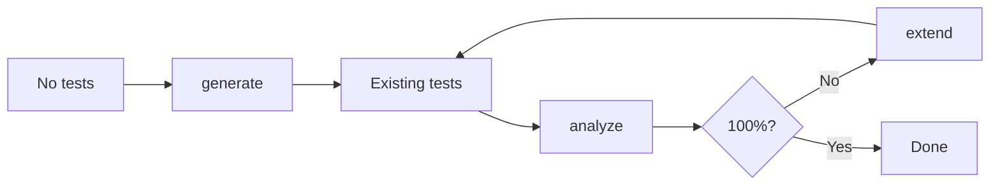

# coverwise

[](https://github.com/libraz/coverwise/actions)
[](https://codecov.io/gh/libraz/coverwise)
[](https://github.com/libraz/coverwise/blob/main/LICENSE)
[](https://en.cppreference.com/w/cpp/17)
[](https://www.typescriptlang.org/)
[](https://github.com/libraz/coverwise)

Combinatorial test coverage engine. Analyzes existing tests for coverage gaps, generates minimal test suites, and extends tests incrementally — in browsers, Node.js, and native C++.

## Overview

coverwise provides three operations that form a test design loop:

- **`analyze`** — Measure an existing test suite's t-wise coverage and list uncovered combinations
- **`extend`** — Generate only the tests needed to close coverage gaps
- **`generate`** — Create a minimal test suite from scratch with full coverage



Most combinatorial tools only support `generate`. coverwise treats `analyze` and `extend` as first-class operations.

## Quick Start

```bash
npm install @libraz/coverwise
```

### Analyze existing tests

```typescript
import { Coverwise } from '@libraz/coverwise';

const cw = await Coverwise.create();

const report = cw.analyzeCoverage({
  parameters: [
    { name: 'os',      values: ['Windows', 'macOS', 'Linux'] },
    { name: 'browser', values: ['Chrome', 'Firefox', 'Safari'] },
    { name: 'env',     values: ['staging', 'production'] },
  ],
  tests: myExistingTests,
});

report.coverageRatio;  // 0.72
report.uncovered;      // ["os=Linux, browser=Safari", "os=Linux, env=production", ...]
```

### Extend with missing coverage

```typescript
const result = cw.extendTests({
  parameters,
  existing: myExistingTests,
});

result.tests.length - myExistingTests.length;  // 3 tests added
result.coverage;   // 1.0
result.uncovered;  // []
```

### Generate from scratch

```typescript
import { when } from '@libraz/coverwise';

const result = cw.generate({
  parameters: [
    { name: 'os',      values: ['Windows', 'macOS', 'Linux'] },
    { name: 'browser', values: ['Chrome', 'Firefox', 'Safari'] },
    { name: 'theme',   values: ['light', 'dark'] },
  ],
  constraints: [
    when('os').eq('Windows').then(when('browser').ne('Safari')).toString(),
  ],
});
```

## Pure TypeScript (no WASM)

A pure TypeScript build is available for environments where WASM is not supported or not needed. Same API, no async initialization required.

```typescript
import { Coverwise } from '@libraz/coverwise/pure';

const cw = await Coverwise.create(); // returns immediately, no WASM loading

const result = cw.generate({
  parameters: [
    { name: 'os',      values: ['Windows', 'macOS', 'Linux'] },
    { name: 'browser', values: ['Chrome', 'Firefox', 'Safari'] },
  ],
});

const report = cw.analyzeCoverage(parameters, existingTests);
const extended = cw.extendTests(existingTests, { parameters });
```

| | WASM (default) | Pure TS |
|---|---|---|
| Import | `@libraz/coverwise` | `@libraz/coverwise/pure` |
| Initialization | `await Coverwise.create()` | `await Coverwise.create()` |
| Performance | Faster (native code) | Slightly slower |
| Dependencies | Requires WASM support | None |
| API | Identical | Identical |

## CLI

```bash
# Analyze existing test coverage
coverwise analyze --params params.json --tests tests.json

# Extend existing tests with missing coverage
coverwise extend --existing tests.json input.json

# Generate a full test suite from scratch
coverwise generate input.json > tests.json

# Preview model complexity
coverwise stats input.json
```

Exit codes: `0` OK, `1` constraint error, `2` insufficient coverage, `3` invalid input.

## Capabilities

| Capability | Description |
|------------|-------------|
| **Coverage analysis** | Measure any test suite's t-wise coverage. List every uncovered combination. |
| **Incremental extension** | Add only the tests needed to close coverage gaps. Preserve existing tests. |
| **Pairwise & t-wise** | 2-wise through arbitrary strength covering arrays. |
| **Constraints** | `IF/THEN/ELSE`, `AND/OR/NOT`, relational (`<`, `>=`), `IN`, `LIKE`. |
| **Negative testing** | Mark values as `invalid` for automatic single-fault negative tests. |
| **Mixed strength** | Sub-models for higher coverage on critical parameter groups. |
| **Boundary values** | Auto-expand numeric ranges into boundary value classes. |
| **Equivalence classes** | Group values into classes and track class-level coverage. |
| **Seed tests** | Build on mandatory tests instead of starting from scratch. |
| **Deterministic** | Same input + seed = identical output, every time. |

## Performance

All configurations achieve 100% t-wise coverage, verified by an independent coverage validator. Test counts fall within known theoretical bounds from covering array research.

### Pairwise (2-wise)

| Configuration | Tuples | Tests | Theoretical Min | WASM | Pure TS |
|---------------|--------|-------|-----------------|------|---------|
| 5 × 3 uniform | 90 | 16 | 9 (OA) | < 1 ms | 1 ms |
| 10 × 3 uniform | 405 | 20 | 9 (OA) | < 1 ms | 1 ms |
| 13 × 3 uniform | 702 | 21 | 9 (OA) | < 1 ms | 1 ms |
| 10 × 5 uniform | 1,125 | 52 | 25 | 1 ms | 1 ms |
| 15 × 4 uniform | 1,680 | 40 | 16 | 1 ms | 1 ms |
| 20 × 2 uniform | 760 | 12 | 4 | < 1 ms | < 1 ms |
| 20 × 5 uniform | 4,750 | 66 | 25 | 4 ms | 2 ms |
| 30 × 5 uniform | 10,875 | 76 | 25 | 9 ms | 5 ms |
| 50 × 3 uniform | 11,025 | 33 | 9 (OA) | 6 ms | 4 ms |
| 5 × 20 high-card | 4,000 | 514 | 400 | 9 ms | 4 ms |

### Higher strength

| Configuration | Strength | Tuples | Tests | WASM | Pure TS |
|---------------|----------|--------|-------|------|---------|
| 15 × 3 | 3-wise | 12,285 | 100 | 11 ms | 9 ms |
| 8 × 3 | 4-wise | 5,670 | 236 | 8 ms | 4 ms |

### High strength (stress test)

| Configuration | Strength | Tuples | Tests | WASM | Pure TS |
|---------------|----------|--------|-------|------|---------|
| 10 × 3 | 5-wise | 61,236 | 885 | 16 ms | 49 ms |
| 8 × 4 | 5-wise | 57,344 | 2,749 | 18 ms | 52 ms |
| 12 × 3 | 6-wise | 673,596 | 3,334 | 218 ms | 789 ms |
| 15 × 3 | 5-wise | 729,729 | 1,277 | 220 ms | 761 ms |
| 20 × 3 | 5-wise | 3,767,472 | 1,581 | 1.4 s | 4.2 s |

Measured on Apple M-series (seed=42). Theoretical Min is from orthogonal array (OA) theory or v² bounds. Greedy algorithms typically produce 1.5–2.5× the theoretical minimum. WASM and Pure TS use different RNG implementations, so test counts may differ slightly.

For pairwise testing (the most common use case), WASM and Pure TS perform equally. WASM shows a ~3× advantage only in high-strength configurations with > 60,000 tuples.

## Build

```bash
# Native (C++)
make build            # Debug build
make test             # Run tests
make release          # Optimized build

# WebAssembly
make wasm             # Build WASM via Emscripten

# JavaScript
yarn build            # Build WASM + TypeScript
yarn test             # Run JS/WASM tests
```

## License

[Apache License 2.0](LICENSE)
