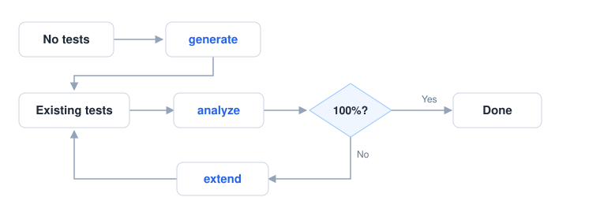

# coverwise

[](https://github.com/libraz/coverwise/actions)
[](https://www.npmjs.com/package/@libraz/coverwise)
[](https://pypi.org/project/coverwise/)
[](https://codecov.io/gh/libraz/coverwise)
[](https://github.com/libraz/coverwise/blob/main/LICENSE)
[](https://en.cppreference.com/w/cpp/17)
[](https://www.typescriptlang.org/)
[](https://github.com/libraz/coverwise)

Combinatorial test coverage engine. Analyzes existing tests for coverage gaps, generates compact test suites, and extends tests incrementally — in browsers, Node.js, and native C++.

## Overview

coverwise provides three operations that form a test design loop:

- **`analyze`** — Measure an existing test suite's t-wise coverage and list uncovered combinations
- **`extend`** — Generate only the tests needed to close coverage gaps
- **`generate`** — Create a compact test suite from scratch with full coverage when the model is satisfiable and no `maxTests` limit prevents it



Most combinatorial tools only support `generate`. coverwise treats `analyze` and `extend` as first-class operations.

## Documentation

- [Introduction](docs/en/introduction.md)
- [Getting Started](docs/en/getting-started.md)
- [Examples](docs/en/examples.md)
- [Constraint Syntax](docs/en/constraints.md)
- [JavaScript API](docs/en/js-api.md)
- [Python API](docs/en/python-api.md)
- [C++ API](docs/en/cpp-api.md)
- [CLI Reference](docs/en/cli.md)
- [Glossary](docs/en/glossary.md)

## Quick Start

```bash
npm install @libraz/coverwise
```

### Analyze existing tests

```typescript
import { Coverwise } from '@libraz/coverwise';

const cw = await Coverwise.create();

const parameters = [
  { name: 'os',      values: ['Windows', 'macOS', 'Linux'] },
  { name: 'browser', values: ['Chrome', 'Firefox', 'Safari'] },
  { name: 'env',     values: ['staging', 'production'] },
];

const report = cw.analyzeCoverage(parameters, myExistingTests);

report.coverageRatio;  // 0.72
report.uncovered;      // [{ display: "os=Linux, browser=Safari", ... }, ...]
```

### Extend with missing coverage

```typescript
const result = cw.extendTests(myExistingTests, { parameters });

result.tests.length - myExistingTests.length;  // 3 tests added
result.coverage;   // 1.0
result.uncovered;  // []
```

### Generate from scratch

```typescript
import { when } from '@libraz/coverwise';

const result = cw.generate({
  parameters: [
    { name: 'os',      values: ['Windows', 'macOS', 'Linux'] },
    { name: 'browser', values: ['Chrome', 'Firefox', 'Safari'] },
    { name: 'theme',   values: ['light', 'dark'] },
  ],
  constraints: [
    when('os').eq('Windows').then(when('browser').ne('Safari')).toString(),
  ],
});
```

## Pure TypeScript (no WASM)

A pure TypeScript build is available for environments where WASM is not supported or not needed. Same API, no async initialization required.

```typescript
import { Coverwise } from '@libraz/coverwise/pure';

const cw = await Coverwise.create(); // returns immediately, no WASM loading

const result = cw.generate({
  parameters: [
    { name: 'os',      values: ['Windows', 'macOS', 'Linux'] },
    { name: 'browser', values: ['Chrome', 'Firefox', 'Safari'] },
  ],
});

const report = cw.analyzeCoverage(parameters, existingTests);
const extended = cw.extendTests(existingTests, { parameters });
```

| | WASM (default) | Pure TS |
|---|---|---|
| Import | `@libraz/coverwise` | `@libraz/coverwise/pure` |
| Initialization | `await Coverwise.create()` | `await Coverwise.create()` |
| Performance | Comparable for pairwise, ahead at high strength | Comparable for pairwise |
| Dependencies | Requires WASM support | None |
| API | Identical | Identical |

## Python

```bash
pip install coverwise
```

The PyPI package ships the native CLI plus a Python API over the same JSON
contract. `generate`, `analyze_coverage`, `extend_tests`, and `estimate_model`
take and return plain dictionaries:

```python
import coverwise

result = coverwise.generate(
    parameters={
        "os": ["Windows", "macOS", "Linux"],
        "browser": ["Chrome", "Firefox", "Safari"],
    },
    constraints=["IF os = Windows THEN browser != Safari"],
)
```

`coverwise.parametrize` turns a model into pytest cases, replacing a
hand-written cross-product with a covering suite:

```python
@coverwise.parametrize({"os": ["Windows", "macOS"], "browser": ["Chrome", "Firefox"]})
def test_login(os, browser):
    assert login(os, browser).ok
```

See the [Python API reference](docs/en/python-api.md).

## CLI

The same executable is installed by `pip install coverwise` on Linux
(x86_64 / aarch64) and macOS 14+ Apple Silicon.

The npm package does not install a native executable. Linux x64 archives are also attached to each
[GitHub Release](https://github.com/libraz/coverwise/releases); source builds produce `build/bin/coverwise`,
and `cmake --install build` installs it to `bin/coverwise` under the chosen prefix.

```bash
# Analyze existing test coverage
coverwise analyze --params params.json --tests tests.json

# Extend existing tests with missing coverage
coverwise extend --existing tests.json input.json

# Generate a full test suite from scratch
coverwise generate input.json > tests.json

# Preview model complexity
coverwise stats input.json
```

Any input path may be `-` to read that JSON from standard input, so commands
compose without intermediate files:

```bash
coverwise generate input.json | coverwise analyze --params input.json --tests -
```

Exit codes: `0` OK, `1` constraint error, `2` insufficient coverage, `3` invalid input.

## Capabilities

| Capability | Description |
|------------|-------------|
| **Coverage analysis** | Measure any test suite's t-wise coverage. List every uncovered combination. |
| **Incremental extension** | Add only the tests needed to close coverage gaps. Preserve existing tests. |
| **Pairwise & t-wise** | 2-wise through arbitrary strength covering arrays. |
| **Constraints** | `IF/THEN/ELSE`, `IMPLIES`, `AND/OR/NOT`, relational (`<`, `>=`), `IN`, `LIKE`. |
| **Negative testing** | Mark values as `invalid` for automatic single-fault negative tests. |
| **Mixed strength** | Sub-models for higher coverage on critical parameter groups. |
| **Boundary values** | Auto-expand numeric ranges into edge and near-edge values. |
| **Equivalence classes** | Group values into classes and track class-level coverage. |
| **Seed tests** | Build on mandatory tests instead of starting from scratch. |
| **Deterministic** | Same valid input + seed = identical output across native C++, WASM, and Pure TS. |

## Performance

The benchmark configurations below achieve 100% t-wise coverage, verified by the
[independent native validator](tests/integration/generate_and_validate_test.cpp). For valid,
satisfiable models within the resource budget, generation without a restrictive `maxTests` limit
targets full coverage; constrained tuples that cannot extend to a valid complete test are excluded
from the required universe. Cross-engine deterministic output is checked by the
[WASM/Pure TS parity suite](js/compat.test.ts).

### Pairwise (2-wise)

| Configuration | Tuples | Tests | Theoretical Min |
|---------------|--------|-------|-----------------|
| 5 × 3 uniform | 90 | 15 | 9 (OA) |
| 10 × 3 uniform | 405 | 21 | 9 (OA) |
| 13 × 3 uniform | 702 | 22 | 9 (OA) |
| 10 × 5 uniform | 1,125 | 52 | 25 |
| 15 × 4 uniform | 1,680 | 41 | 16 |
| 20 × 2 uniform | 760 | 13 | 4 |
| 20 × 5 uniform | 4,750 | 65 | 25 |
| 30 × 5 uniform | 10,875 | 74 | 25 |
| 50 × 3 uniform | 11,025 | 33 | 9 (OA) |
| 5 × 20 high-card | 4,000 | 514 | 400 |

### Higher strength

| Configuration | Strength | Tuples | Tests |
|---------------|----------|--------|-------|
| 15 × 3 | 3-wise | 12,285 | 98 |
| 8 × 3 | 4-wise | 5,670 | 225 |

### High strength (stress test)

| Configuration | Strength | Tuples | Tests |
|---------------|----------|--------|-------|
| 10 × 3 | 5-wise | 61,236 | 880 |
| 8 × 4 | 5-wise | 57,344 | 2,764 |
| 12 × 3 | 6-wise | 673,596 | 3,349 |
| 15 × 3 | 5-wise | 729,729 | 1,297 |
| 20 × 3 | 5-wise | 3,767,472 | 1,592 |

Tuple and test counts are what the bundled generator produces at `seed: 42`, regenerated by the
[documentation contract test](tests/integration/docs_contract_test.cpp) on every run, so an
algorithm change shows up as a failing test rather than as a stale table. Theoretical Min is from
orthogonal array (OA) theory or v² bounds; greedy algorithms typically produce 1.5–2.5× the
theoretical minimum. Native C++, WASM, and Pure TS share xoshiro128** with SplitMix32 seeding and
rejection sampling, so identical valid input and seed produce the same suite across engines.

Run times are deliberately not published per configuration: they depend on the host, the runtime and
the build, and nothing in the repository can re-derive them. As a shape rather than a figure, the two
JavaScript engines are close on pairwise models, and the WASM engine pulls ahead as strength and
tuple count grow — benchmark the configuration you care about on your own hardware.

## Build

```bash
# Native (C++)
make build            # Debug build
make test             # Run tests
make release          # Optimized build
cmake --install build --prefix ./install  # Library, headers, CMake package, and CLI

# WebAssembly
make wasm             # Build WASM via Emscripten

# JavaScript
yarn build            # Build WASM + TypeScript
yarn test             # Run JS/WASM tests
```

## License

[Apache License 2.0](LICENSE)
