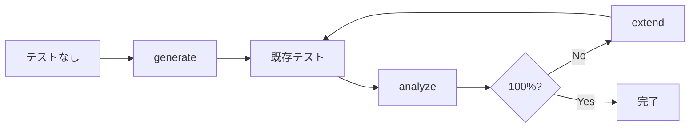

# coverwise

[](https://github.com/libraz/coverwise/actions)
[](https://codecov.io/gh/libraz/coverwise)
[](https://github.com/libraz/coverwise/blob/main/LICENSE)
[](https://en.cppreference.com/w/cpp/17)
[](https://www.typescriptlang.org/)
[](https://github.com/libraz/coverwise)

組み合わせテストカバレッジエンジン。既存テストのカバレッジギャップを分析し、最小テストスイートを生成し、差分だけを追加拡張します。ブラウザ、Node.js、ネイティブ C++ で動作。

## 概要

coverwise はテスト設計ループを構成する3つの操作を提供します：

- **`analyze`** — 既存テストスイートの t-wise カバレッジを計測し、未カバーの組み合わせを列挙
- **`extend`** — カバレッジギャップを埋めるテストだけを生成
- **`generate`** — ゼロから完全カバレッジの最小テストスイートを作成



多くの組み合わせテストツールは `generate` のみをサポートしています。coverwise は `analyze` と `extend` を同等の操作として扱います。

## クイックスタート

```bash
npm install @libraz/coverwise
```

### 既存テストを分析する

```typescript
import { Coverwise } from '@libraz/coverwise';

const cw = await Coverwise.create();

const report = cw.analyzeCoverage({
  parameters: [
    { name: 'os',      values: ['Windows', 'macOS', 'Linux'] },
    { name: 'browser', values: ['Chrome', 'Firefox', 'Safari'] },
    { name: 'env',     values: ['staging', 'production'] },
  ],
  tests: myExistingTests,
});

report.coverageRatio;  // 0.72
report.uncovered;      // ["os=Linux, browser=Safari", "os=Linux, env=production", ...]
```

### 不足分を拡張する

```typescript
const result = cw.extendTests({
  parameters,
  existing: myExistingTests,
});

result.tests.length - myExistingTests.length;  // 3テスト追加
result.coverage;   // 1.0
result.uncovered;  // []
```

### ゼロから生成する

```typescript
import { when } from '@libraz/coverwise';

const result = cw.generate({
  parameters: [
    { name: 'os',      values: ['Windows', 'macOS', 'Linux'] },
    { name: 'browser', values: ['Chrome', 'Firefox', 'Safari'] },
    { name: 'theme',   values: ['light', 'dark'] },
  ],
  constraints: [
    when('os').eq('Windows').then(when('browser').ne('Safari')).toString(),
  ],
});
```

## Pure TypeScript（WASMなし）

WASMが使えない環境や不要な場合に、純粋なTypeScript版を利用できます。APIは同一で、非同期の初期化は不要です。

```typescript
import { Coverwise } from '@libraz/coverwise/pure';

const cw = await Coverwise.create(); // 即座に返る、WASMロードなし

const result = cw.generate({
  parameters: [
    { name: 'os',      values: ['Windows', 'macOS', 'Linux'] },
    { name: 'browser', values: ['Chrome', 'Firefox', 'Safari'] },
  ],
});

const report = cw.analyzeCoverage(parameters, existingTests);
const extended = cw.extendTests(existingTests, { parameters });
```

| | WASM（デフォルト） | Pure TS |
|---|---|---|
| インポート | `@libraz/coverwise` | `@libraz/coverwise/pure` |
| 初期化 | `await Coverwise.create()` | `await Coverwise.create()` |
| パフォーマンス | 高速（ネイティブコード） | やや低速 |
| 依存 | WASM対応が必要 | なし |
| API | 同一 | 同一 |

## CLI

```bash
# 既存テストのカバレッジを分析
coverwise analyze --params params.json --tests tests.json

# 不足カバレッジを補うテストを追加
coverwise extend --existing tests.json input.json

# テストスイートをゼロから生成
coverwise generate input.json > tests.json

# モデルの複雑さを確認
coverwise stats input.json
```

終了コード: `0` 成功、`1` 制約エラー、`2` カバレッジ不足、`3` 入力不正。

## 機能一覧

| 機能 | 説明 |
|------|------|
| **カバレッジ分析** | 任意のテストスイートの t-wise カバレッジを計測。未カバーの組み合わせをすべて列挙。 |
| **増分拡張** | カバレッジギャップを埋めるテストだけを追加。既存テストはそのまま保持。 |
| **ペアワイズ & t-wise** | 2-wise から任意の強度のカバリング配列を生成。 |
| **制約** | `IF/THEN/ELSE`、`AND/OR/NOT`、関係演算（`<`、`>=`）、`IN`、`LIKE`。 |
| **ネガティブテスト** | 値を `invalid` 指定して単一障害のネガティブテストを自動生成。 |
| **混合強度** | サブモデルで重要パラメータ群に高い網羅度を設定。 |
| **境界値** | 整数・浮動小数点の範囲を自動的に境界値クラスに展開。 |
| **同値クラス** | 値をクラスにグループ化し、クラスレベルのカバレッジを追跡。 |
| **シードテスト** | 必須テストを起点に、不足分だけを追加生成。 |
| **決定的出力** | 同じ入力＋シード＝毎回同じ出力。 |

## パフォーマンス

すべての構成で 100% t-wise カバレッジを達成。独立したカバレッジバリデータで検証済みです。生成テスト数はカバリングアレイ研究の既知の理論的境界内に収まっています。

### ペアワイズ (2-wise)

| 構成 | タプル数 | テスト数 | 理論下限 | WASM | Pure TS |
|------|---------|---------|---------|------|---------|
| 5 × 3 均一 | 90 | 16 | 9 (OA) | < 1 ms | 1 ms |
| 10 × 3 均一 | 405 | 20 | 9 (OA) | < 1 ms | 1 ms |
| 13 × 3 均一 | 702 | 21 | 9 (OA) | < 1 ms | 1 ms |
| 10 × 5 均一 | 1,125 | 52 | 25 | 1 ms | 1 ms |
| 15 × 4 均一 | 1,680 | 40 | 16 | 1 ms | 1 ms |
| 20 × 2 均一 | 760 | 12 | 4 | < 1 ms | < 1 ms |
| 20 × 5 均一 | 4,750 | 66 | 25 | 4 ms | 2 ms |
| 30 × 5 均一 | 10,875 | 76 | 25 | 9 ms | 5 ms |
| 50 × 3 均一 | 11,025 | 33 | 9 (OA) | 6 ms | 4 ms |
| 5 × 20 高カーディナリティ | 4,000 | 514 | 400 | 9 ms | 4 ms |

### 高強度

| 構成 | 強度 | タプル数 | テスト数 | WASM | Pure TS |
|------|------|---------|---------|------|---------|
| 15 × 3 | 3-wise | 12,285 | 100 | 11 ms | 9 ms |
| 8 × 3 | 4-wise | 5,670 | 236 | 8 ms | 4 ms |

### 高強度（ストレステスト）

| 構成 | 強度 | タプル数 | テスト数 | WASM | Pure TS |
|------|------|---------|---------|------|---------|
| 10 × 3 | 5-wise | 61,236 | 885 | 16 ms | 49 ms |
| 8 × 4 | 5-wise | 57,344 | 2,749 | 18 ms | 52 ms |
| 12 × 3 | 6-wise | 673,596 | 3,334 | 218 ms | 789 ms |
| 15 × 3 | 5-wise | 729,729 | 1,277 | 220 ms | 761 ms |
| 20 × 3 | 5-wise | 3,767,472 | 1,581 | 1.4 s | 4.2 s |

Apple M シリーズで計測（seed=42）。理論下限は直交配列 (OA) 理論または v² 下界に基づく既知の下限値。貪欲法アルゴリズムは一般に理論最小値の 1.5〜2.5 倍のテスト数を生成します。WASM と Pure TS は異なる RNG 実装を使用するため、テスト数はわずかに異なる場合があります。

ペアワイズ（最も一般的なユースケース）では WASM と Pure TS は同等の性能です。WASM が約3倍の優位を示すのは、60,000タプルを超える高強度構成のみです。

## ビルド

```bash
# ネイティブ (C++)
make build            # デバッグビルド
make test             # テスト実行
make release          # 最適化ビルド

# WebAssembly
make wasm             # EmscriptenでWASMビルド

# JavaScript
yarn build            # WASM + TypeScriptビルド
yarn test             # JS/WASMテスト実行
```

## ライセンス

[Apache License 2.0](LICENSE)
