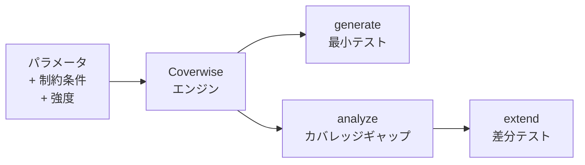

# coverwise

[](https://github.com/libraz/coverwise/actions)
[](https://codecov.io/gh/libraz/coverwise)
[](https://github.com/libraz/coverwise/blob/main/LICENSE)
[](https://en.cppreference.com/w/cpp/17)
[](https://github.com/libraz/coverwise)

高品質なテストスイートを設計するためのモダンな組み合わせテストエンジン。完全なカバレッジを保証。

テストケースの生成・分析・拡張を、ブラウザ、Node.js、ネイティブC++で実行。

## なぜ Coverwise？

バグの多くはコンポーネント間の予期しない相互作用から生まれます。Coverwiseはその相互作用を体系的に網羅します。

- **テスト品質を証明** — 正確なカバレッジ指標と、漏れている組み合わせをすべて特定
- **テストを設計する** — 生成するだけでなく、既存スイートの分析と増分拡張が可能
- **どこでも動作** — ブラウザ、CI、バックエンド — WASMによりネイティブ依存ゼロ

QAエンジニア、SDET、そして組み合わせ爆発なしに体系的なカバレッジを必要とする開発者のために。

## 仕組み



## クイックスタート

### JavaScript / TypeScript

```bash
npm install @libraz/coverwise
```

```typescript
import { Coverwise, when } from '@libraz/coverwise';

const cw = await Coverwise.create();

// ペアワイズカバレッジ100%の最小テストスイートを生成
const result = cw.generate({
  parameters: [
    { name: 'os',      values: ['Windows', 'macOS', 'Linux'] },
    { name: 'browser', values: ['Chrome', 'Firefox', 'Safari'] },
    { name: 'theme',   values: ['light', 'dark'] },
  ],
  constraints: [
    when('os').eq('Windows').then(when('browser').ne('Safari')).toString(),
  ],
});
console.log(result.tests);    // 10テスト、100%カバレッジ
console.log(result.uncovered); // [] — 漏れなし

// 既存テストの実際のカバレッジを計測
const report = cw.analyzeCoverage(parameters, myExistingTests);
console.log(report.coverageRatio); // 0.72
console.log(report.uncovered);     // ["os=Linux, browser=Safari", ...]

// ギャップだけを埋める — ゼロから再生成は不要
const extended = cw.extendTests(myExistingTests, { parameters, constraints });
console.log(extended.tests.length - myExistingTests.length); // 3テスト追加
```

## できること

| 機能 | 説明 |
|------|------|
| **ペアワイズ & t-wise** | 2-wise から任意の強度のカバリング配列を生成 |
| **制約** | `IF/THEN/ELSE`、`AND/OR/NOT`、関係演算（`<`、`>=`）、`IN`、`LIKE` |
| **ネガティブテスト** | 値を `invalid` 指定して単一障害のネガティブテストを自動生成 |
| **混合強度** | サブモデルで重要パラメータ群に高い網羅度を設定 |
| **境界値** | 整数・浮動小数点の範囲を自動的に境界値クラスに展開 |
| **同値クラス** | 値をクラスにグループ化し、クラスレベルのカバレッジを追跡 |
| **シードテスト** | 既存テストを活用して差分だけを追加生成 |
| **重み付け** | カバレッジが同等の場合に特定の値を優先 |
| **カバレッジ分析** | 任意のテストスイートのt-wiseカバレッジを独立検証 |
| **決定的出力** | 同じ入力＋シード＝毎回同じ出力 |

## CLI

```bash
# JSON仕様からテストを生成
coverwise generate input.json > tests.json

# 既存テストのカバレッジを分析
coverwise analyze --params params.json --tests tests.json

# 既存テストを拡張
coverwise extend --existing tests.json input.json

# モデル統計をプレビュー
coverwise stats input.json
```

終了コード: `0` 成功、`1` 制約エラー、`2` カバレッジ不足、`3` 入力不正。

## パフォーマンス

すべての構成で **100% t-wise カバレッジ** を達成し、独立したカバレッジバリデータで検証済みです。生成テスト数はカバリングアレイ研究の既知の理論的境界内に収まっています。

### ペアワイズ (2-wise) 生成

| 構成 | パラメータ数 | 値の数 | タプル数 | テスト数 | 理論下限 | 時間 |
|------|------------|--------|---------|---------|---------|------|
| 5 × 3 均一 | 5 | 3 | 90 | 16 | 9 (OA) | < 1 ms |
| 10 × 3 均一 | 10 | 3 | 405 | 20 | 9 (OA) | < 1 ms |
| 13 × 3 均一 | 13 | 3 | 702 | 21 | 9 (OA) | < 1 ms |
| 10 × 5 均一 | 10 | 5 | 1,125 | 52 | 25 | 1 ms |
| 15 × 4 均一 | 15 | 4 | 1,680 | 40 | 16 | 1 ms |
| 20 × 2 均一 | 20 | 2 | 760 | 12 | 4 | < 1 ms |
| 20 × 5 均一 | 20 | 5 | 4,750 | 66 | 25 | 4 ms |
| 30 × 5 均一 | 30 | 5 | 10,875 | 76 | 25 | 9 ms |
| 50 × 3 均一 | 50 | 3 | 11,025 | 33 | 9 (OA) | 6 ms |
| 5 × 20 高カーディナリティ | 5 | 20 | 4,000 | 514 | 400 | 9 ms |
| 3⁴ × 2³ 混合 | 7 | 2–3 | 138 | 14 | 9 | < 1 ms |
| 5¹ × 3³ × 2⁴ 混合 | 8 | 2–5 | 208 | 19 | 15 | < 1 ms |

### 高強度生成

| 構成 | パラメータ数 | 値の数 | 強度 | タプル数 | テスト数 | 時間 |
|------|------------|--------|------|---------|---------|------|
| 15 × 3 | 15 | 3 | 3-wise | 12,285 | 100 | 11 ms |
| 8 × 3 | 8 | 3 | 4-wise | 5,670 | 236 | 8 ms |

Apple M シリーズで計測（seed=42）。「理論下限」は直交配列 (OA) 理論または v² 下界に基づく既知の下限値です。貪欲法アルゴリズムは一般に理論最小値の 1.5〜2.5 倍のテスト数を生成します — これはカバリングアレイ生成器の公開された研究結果と一致しています。

## ビルド

```bash
# ネイティブ (C++)
make build            # デバッグビルド
make test             # テスト実行
make release          # 最適化ビルド

# WebAssembly
make wasm             # EmscriptenでWASMビルド

# JavaScript
yarn build            # WASM + TypeScriptビルド
yarn test             # JS/WASMテスト実行
```

## ライセンス

[Apache License 2.0](LICENSE)
