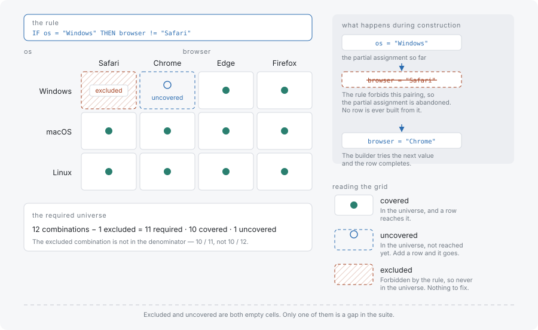

# Constraints and the required universe

A **constraint** is a boolean expression over the model's parameters and values that says which combinations are not real: Safari does not run on Windows, and an ARM32 build has no macOS host. A constraint does two things at once, and keeping them apart is what this page is for: it decides which test cases are built, and it decides which tuples the suite is required to cover. This page assumes the counting in [Tuples and coverage](tuples-and-coverage.md).

## A constraint prunes construction



Constraints are enforced during construction, not after it. The generator evaluates the expressions against the partial assignment it is building and abandons a branch that can no longer satisfy them, so a violating row is never completed in the first place — there is no generate-and-filter pass, and no invalid row ever reaches the output to be discarded.

```typescript
import { Coverwise } from '@libraz/coverwise';

const cw = await Coverwise.create();

const result = cw.generate({
  parameters: [
    { name: 'os',      values: ['Windows', 'macOS', 'Linux'] },
    { name: 'browser', values: ['Chrome', 'Firefox', 'Safari'] },
  ],
  constraints: ['IF os = Windows THEN browser != Safari'],
});

result.tests.length; // 8
result.coverage; // 1

for (const test of result.tests) {
  console.log(test);
}
// { os: 'macOS', browser: 'Firefox' }
// { os: 'macOS', browser: 'Safari' }
// { os: 'Linux', browser: 'Firefox' }
// { os: 'macOS', browser: 'Chrome' }
// { os: 'Linux', browser: 'Chrome' }
// { os: 'Windows', browser: 'Firefox' }
// { os: 'Windows', browser: 'Chrome' }
// { os: 'Linux', browser: 'Safari' }
```

No row pairs Windows with Safari, and coverage is still reported as 1. Both of those are consequences of the same decision, and the second one needs an explanation: the model has nine value pairs, the suite contains eight of them, and the report says complete.

## The same constraint shrinks what is required

The pair `(os=Windows, browser=Safari)` cannot appear in any valid test case. Requiring it would mean requiring something no suite can ever contain — 100% coverage would be unreachable by definition, and every report would carry a permanent shortfall that no amount of extra rows could close.

So the pair leaves the **required universe**. A tuple is excluded exactly when no assignment of valid values to the remaining parameters completes it into a test case satisfying every constraint. That is a decision about the tuple, not about the suite, and it is made before any row exists.

Measuring one hand-written suite twice, against the same model with and without the constraints, shows the universe change on its own. First without:

```typescript
import { Coverwise } from '@libraz/coverwise';

const cw = await Coverwise.create();

const parameters = [
  { name: 'os', values: ['Windows', 'macOS', 'Linux'] },
  { name: 'browser', values: ['Chrome', 'Firefox', 'Safari'] },
];

const tests = [
  { os: 'Windows', browser: 'Chrome' },
  { os: 'Windows', browser: 'Firefox' },
  { os: 'macOS', browser: 'Firefox' },
  { os: 'macOS', browser: 'Safari' },
  { os: 'Linux', browser: 'Chrome' },
  { os: 'Linux', browser: 'Firefox' },
  { os: 'Linux', browser: 'Safari' },
];

const report = cw.analyzeCoverage(parameters, tests);

report.totalTuples; // 9
report.coverageRatio; // 0.7777777777777778 (7 of 9 pairs covered)
report.uncoveredCount; // 2 — os=Windows/browser=Safari and os=macOS/browser=Chrome
```

Then with the constraint, over the same seven rows:

```typescript
import { Coverwise } from '@libraz/coverwise';

const cw = await Coverwise.create();

const parameters = [
  { name: 'os', values: ['Windows', 'macOS', 'Linux'] },
  { name: 'browser', values: ['Chrome', 'Firefox', 'Safari'] },
];

const tests = [
  { os: 'Windows', browser: 'Chrome' },
  { os: 'Windows', browser: 'Firefox' },
  { os: 'macOS', browser: 'Firefox' },
  { os: 'macOS', browser: 'Safari' },
  { os: 'Linux', browser: 'Chrome' },
  { os: 'Linux', browser: 'Firefox' },
  { os: 'Linux', browser: 'Safari' },
];

const constraints = ['IF os = Windows THEN browser != Safari'];

const report = cw.analyzeCoverage(parameters, tests, 2, constraints);

report.totalTuples; // 8
report.coverageRatio; // 0.875 (7 of 8 pairs covered)
report.uncoveredCount; // 1 — os=macOS/browser=Chrome
```

The suite did not change. The denominator did, from 9 to 8, and one of the two missing pairs stopped being missing — it stopped being required.

## Excluded is not uncovered

Both are pairs the suite does not contain, and they mean opposite things. An excluded tuple is absent because it cannot exist; an uncovered tuple is absent because the suite has a gap.

| Reading the report | Excluded tuple | Uncovered tuple |
|---|---|---|
| Why it is absent | No valid test case could hold it | Every row that could hold it was left out |
| Counted in `totalTuples` | No | Yes |
| Listed in `uncovered` | No | Yes |
| Effect on `coverageRatio` | None; it is not in the denominator | Lowers it |
| What to do about it | Nothing, unless the constraint itself is wrong | Add rows, or run `extend` to append them |

The practical consequence is that `uncovered` is a list of real gaps and nothing else, so it can be read as a work list without filtering. A pair missing from that list is a pair the constraints have ruled out, and when that is unexpected the constraint is the thing to re-read rather than the suite.

That still holds when generation stops short. A `maxTests` cap leaves units uncovered, and what it reports are required units the run did not reach, never units the constraints removed.

Two more places the same distinction shows up. A tuple containing a value marked `invalid` is likewise excluded from positive coverage, since a positive row never carries one. And the model-size estimate taken before generation — `estimateModel`, or `coverwise stats` — reports the raw universe with constraints not subtracted, because estimating deliberately does not solve the model; for the constrained model above it answers 9 where the generated result answers 8. The required universe is the number in the result of the operation that was actually run.

## When a constraint set excludes everything

Constraints that leave no valid complete assignment are an error rather than an empty suite. Generation reports `Constraints are unsatisfiable`, and the CLI exits with code 1. This is distinct from insufficient coverage, which exits with code 2: an unsatisfiable model has nothing to cover, while an under-covered one has units nobody reached.

The usual cause is two constraints that are each reasonable and jointly impossible, and the usual fix is to widen a parameter's values rather than to weaken a constraint that describes the real system. [Constraint syntax](../constraints.md) is the reference for the expression language, including operators, the `IN` and `LIKE` forms, and the JavaScript builder.

## Where to go next

- [Constraint syntax](../constraints.md) — the full expression syntax, the builder API, and quoting rules.
- [Tuples and coverage](tuples-and-coverage.md) — the counting this page changed the denominator of.
- [Use cases](../use-cases/index.md) — reading `uncovered` as a work list against a suite that already exists.
- [Glossary](../glossary.md) — constraint, constraint pruning, total tuples and uncovered tuple, defined on their own.
