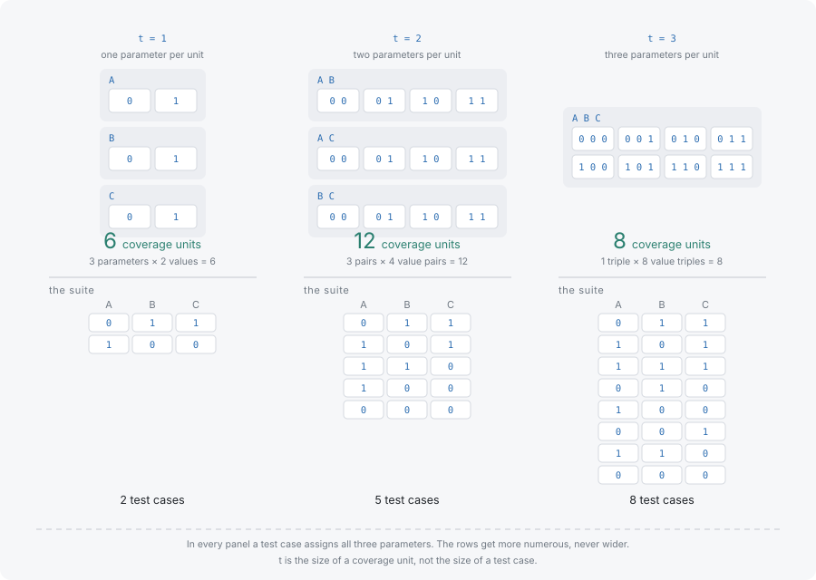

# Strength

Strength, written t, is the number of parameters in one coverage unit. It is not the number of parameters in a test case: every test case names every parameter at every strength, and t only decides how large a group has to be before the suite is required to cover it exhaustively. This page assumes the counting in [Tuples and coverage](tuples-and-coverage.md).

## t sizes the coverage unit, not the test case



On the three binary parameters A, B and C, changing t changes what the suite must contain and nothing about the shape of a row.

| t | Coverage units for A, B and C | What every test case names |
|---|---|---|
| 1 | 6 units — each value of each parameter, once | A, B and C |
| 2 | 12 units — every value pair from two parameters | A, B and C |
| 3 | 8 units — every value triple from all three | A, B and C |

The arithmetic behind the middle column is the same at every t. For a model of k parameters with v values each, strength t requires one unit for every choice of t parameters times every assignment of values to them: C(k, t) · v^t. Here that is 3 · 2 at t=1, 3 · 4 at t=2 and 1 · 8 at t=3.

Notice that t=3 needs fewer units than t=2 on this model, because there is only one way to choose three parameters out of three. Fewer units does not mean fewer rows: the 12 units at t=2 fit into 4 rows, while the 8 units at t=3 need 8, because no row can carry more than one triple.

`strength` is a field of the model, defaulting to 2. It sets the universe that generation targets and that coverage is measured against, so the same number has to be used for both — analyzing a 3-wise suite at the default strength measures its pairs and reports 100% while saying nothing about its triples.

## What t=2 leaves untested

A pairwise suite is complete for pairs and silent about everything larger. Measuring the four-row suite from the previous page at strength 3 says exactly how silent.

```typescript
import { Coverwise } from '@libraz/coverwise';

const cw = await Coverwise.create();

const report = cw.analyzeCoverage(
  [
    { name: 'A', values: ['0', '1'] },
    { name: 'B', values: ['0', '1'] },
    { name: 'C', values: ['0', '1'] },
  ],
  [
    { A: '1', B: '1', C: '0' },
    { A: '0', B: '1', C: '1' },
    { A: '0', B: '0', C: '0' },
    { A: '1', B: '0', C: '1' },
  ],
  3,
);

report.totalTuples; // 8
report.coveredTuples; // 4
report.coverageRatio; // 0.5 (4 of 8 triples covered)
report.uncoveredCount; // 4 — including A=1, B=1, C=1
```

Half the triples are absent, and one of them is the all-ones combination. A defect that needs A, B and C to be `'1'` simultaneously survives a suite with perfect pairwise coverage. This is not a flaw in the suite; it is the guarantee being read for more than it says.

## When raising t is justified

Raise t when the system's failures are known to need deeper interaction — a defect that only appears under a particular combination of three settings, a protocol negotiated from three independent options, a state machine whose transitions depend on three flags. Past incidents are the evidence to use: a fault that took three specific values to reproduce is the argument for t=3 in that area.

Raising it because deeper feels safer is the case to resist. t=3 is not "pairwise, but better tested"; it is a different and much larger universe, and it buys nothing on the parameters whose faults were already single or paired.

When only part of the model needs the depth, a sub-model gives that group its own strength while the rest stays pairwise, which costs far less than raising t everywhere. [Examples](../examples.md) shows the shape.

## What it costs

Both terms of C(k, t) · v^t grow with t, and suite size grows with them. On the three-parameter model, t=3 is the exhaustive set — when t equals the parameter count, the only suite covering every unit is every combination.

```typescript
import { Coverwise } from '@libraz/coverwise';

const cw = await Coverwise.create();

const result = cw.generate({
  parameters: [
    { name: 'A', values: ['0', '1'] },
    { name: 'B', values: ['0', '1'] },
    { name: 'C', values: ['0', '1'] },
  ],
  strength: 3,
});

result.stats.totalTuples; // 8
result.tests.length; // 8

for (const test of result.tests) {
  console.log(test);
}
// { A: '0', B: '1', C: '1' }
// { A: '1', B: '0', C: '1' }
// { A: '1', B: '1', C: '1' }
// { A: '0', B: '1', C: '0' }
// { A: '1', B: '0', C: '0' }
// { A: '0', B: '0', C: '1' }
// { A: '1', B: '1', C: '0' }
// { A: '0', B: '0', C: '0' }
```

On a model with more parameters the exhaustive set stays out of reach and the covering array does not, but the suite still grows sharply with each step in t, and generation time grows with it. [Performance](../performance.md) publishes measured tuple counts, suite sizes and timings from t=2 through t=6, which is the table to read before committing to a higher strength.

## Where to go next

- [Constraints and the required universe](constraints-and-the-universe.md) — the other thing that changes which units are required.
- [Performance](../performance.md) — measured cost of each strength on models of realistic size.
- [Examples](../examples.md) — sub-models, so one critical group can be 3-wise while the rest stays pairwise.
- [Input limits](../limits.md) — the ceilings on parameters, values and rows that bound any strength.
