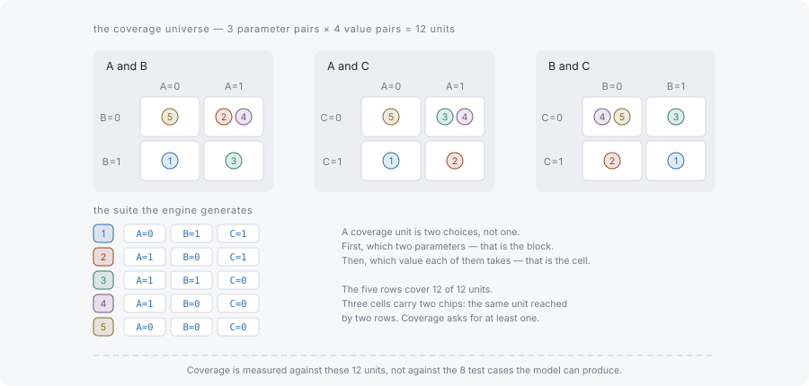

# Tuples and coverage

This page counts, on a model small enough to check by hand, the thing a covering array covers. It assumes [What combinatorial testing is](what-is-combinatorial-testing.md), which established that a reduced suite has to be defined by a property; here the property gets its exact statement.

## A tuple is values from different parameters

A **tuple** is a combination of one value from each of t different parameters. With t = 2 and parameters `os` and `browser`, the pair `(os=Windows, browser=Chrome)` is a tuple. A tuple names some of the parameters, never more than once each; a **test case** names all of them.

A **coverage unit** is a tuple the suite is required to contain. For an unconstrained model at strength t, the coverage units are every tuple the model can form — the **required universe**. Coverage is then a counting question: how many of those units appear in at least one test case.

The model for the rest of this page has three parameters with two values each: A, B and C, each holding `'0'` and `'1'`.

## Counting the units



Counting happens on two levels, and conflating them is the usual first mistake. First choose the parameters: from A, B and C there are three pairs of parameters — A with B, A with C, B with C. Then choose the values: each of those pairs has 2 × 2 = 4 value combinations. Three parameter pairs times four value combinations is 12 coverage units.

The rows drawn beside the blocks are the five the default seed produces for this model; a four-row suite covering the same 12 units appears later on this page.

The count depends only on the model and the strength, not on any suite. It is what a report calls `totalTuples`, and it is the denominator of every coverage number coverwise prints.

## A covering array covers every unit

Four test cases are enough to hold all twelve units, which is fewer rows than the eight of the exhaustive set.

```typescript
import { Coverwise } from '@libraz/coverwise';

const cw = await Coverwise.create();

const result = cw.generate({
  parameters: [
    { name: 'A', values: ['0', '1'] },
    { name: 'B', values: ['0', '1'] },
    { name: 'C', values: ['0', '1'] },
  ],
  seed: 1,
});

result.stats.totalTuples; // 12
result.tests.length; // 4
result.coverage; // 1

for (const test of result.tests) {
  console.log(test);
}
// { A: '1', B: '1', C: '0' }
// { A: '0', B: '1', C: '1' }
// { A: '0', B: '0', C: '0' }
// { A: '1', B: '0', C: '1' }
```

Read the four rows down any two columns and the four value combinations for that pair are all present. Each row carries three of the twelve units at once, which is why twelve units fit into four rows: one row covers the A-B pair, the A-C pair and the B-C pair it happens to hold.

Four is also the minimum for this model, and reaching it here took a seed. coverwise constructs suites greedily and does not search for the smallest one: the default seed produces five rows for this model, and both suites are complete covering arrays. Correctness is the guarantee, and row count is an approximation — see [Determinism](../determinism.md) for what a seed does and does not fix.

## Coverage ratio

The **coverage ratio** is covered units divided by required units. It is reported as `coverage` by `generate` and as `coverageRatio` by `analyzeCoverage`, and both are measured by enumerating the units independently of the generator, so the number holds for a hand-written suite as well.

```typescript
import { Coverwise } from '@libraz/coverwise';

const cw = await Coverwise.create();

const report = cw.analyzeCoverage(
  [
    { name: 'A', values: ['0', '1'] },
    { name: 'B', values: ['0', '1'] },
    { name: 'C', values: ['0', '1'] },
  ],
  [{ A: '0', B: '0', C: '0' }],
);

report.totalTuples; // 12
report.coveredTuples; // 3 (one row holds one unit per parameter pair)
report.coverageRatio; // 0.25 (3 of 12 units covered)
report.uncoveredCount; // 9
```

A ratio below 1 is a list, not a score. Every unit counted as missing is reported in `uncovered` with the parameters and values that make it up, so the gap is nameable and can be closed by adding rows. `uncovered` stops at a diagnostic cap and `omittedUncovered` says how many were left out, so the array always holds exactly `uncoveredCount - omittedUncovered` entries.

## Where to go next

- [Strength](strength.md) — the t that decided there were three parameter pairs and not four triples.
- [Constraints and the required universe](constraints-and-the-universe.md) — how forbidding a combination removes units from the denominator.
- [JavaScript API](../js-api.md) — the full shape of `GenerateResult` and `CoverageReport`.
- [Glossary](../glossary.md) — tuple, coverage unit, covering array and coverage ratio, defined on their own.
