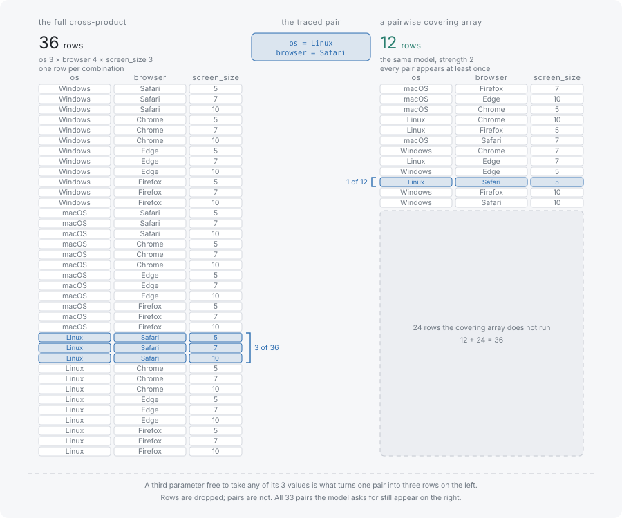

# What combinatorial testing is

Combinatorial testing is the practice of choosing test cases by a stated coverage property over the parameters of a system, rather than by count or by intuition. It is not random sampling of the input space, and it is not a heuristic that shrinks an existing suite: the suite is constructed from the property, and the property is what then holds of the finished suite.

## Every combination is too many

Take a model with three parameters: an operating system with three values, a browser with four, and a screen size with three. Testing every combination means 3 × 4 × 3 = 36 test cases. That is already more than most teams run by hand for one feature, and it is the smallest interesting case.

The count is a product, so it grows by multiplication. Add a fourth parameter with three values and the cross-product is 108. Ten parameters with three values each is 59,049 combinations. The exhaustive suite stops being an option long before the model stops being realistic.

So a real suite is always a subset. Which subset it is decides what can be claimed for it.

## A random subset leaves gaps nobody can name

Picking twelve of the thirty-six rows at random produces a suite of a defensible size and no defensible description. What it tests is twelve combinations. Whether Firefox was ever run on Linux, or whether a large screen was ever paired with Edge, can only be answered by reading the rows, and what a passing run rules out cannot be answered at all.

The same objection applies to a suite that was written by hand and grew by accident. It may be large and still leave a specific pair untried, and nothing about it names which pair.

A useful reduction has to be defined by a property that holds over the whole set, so that the property is what a passing run establishes.

## A covering array is a subset defined by its guarantee



A **covering array** is a set of test cases in which every combination of values from any two parameters appears in at least one row. That property, and not the row count, is the definition. The row count is whatever satisfying the property takes.

```typescript
import { Coverwise } from '@libraz/coverwise';

const cw = await Coverwise.create();

const result = cw.generate({
  parameters: [
    { name: 'os',      values: ['Windows', 'macOS', 'Linux'] },
    { name: 'browser', values: ['Chrome', 'Firefox', 'Safari', 'Edge'] },
    { name: 'screen',  values: ['small', 'medium', 'large'] },
  ],
});

result.tests.length; // 12
result.stats.totalTuples; // 33 (12 os-browser pairs + 9 os-screen + 12 browser-screen)
result.coverage; // 1

for (const test of result.tests) {
  console.log(test);
}
// { os: 'macOS', browser: 'Edge', screen: 'medium' }
// { os: 'macOS', browser: 'Safari', screen: 'large' }
// { os: 'macOS', browser: 'Firefox', screen: 'small' }
// { os: 'Linux', browser: 'Firefox', screen: 'large' }
// { os: 'Linux', browser: 'Edge', screen: 'small' }
// { os: 'macOS', browser: 'Chrome', screen: 'medium' }
// { os: 'Windows', browser: 'Firefox', screen: 'medium' }
// { os: 'Linux', browser: 'Safari', screen: 'medium' }
// { os: 'Windows', browser: 'Safari', screen: 'small' }
// { os: 'Linux', browser: 'Chrome', screen: 'small' }
// { os: 'Windows', browser: 'Edge', screen: 'large' }
// { os: 'Windows', browser: 'Chrome', screen: 'large' }
```

Twelve rows out of thirty-six hold all thirty-three value pairs. Every row carries a value for every parameter, exactly as an exhaustive row would; what the reduction removes is repetition of pairs that some other row already covers. Pick any two parameters and any two values for them, and the suite contains a row holding both.

That claim is checkable, because coverage is measured by enumerating the pairs independently of the generator — see [Questions and limitations](../faq.md) for why the measurement is kept separate from the code that produced the rows. [Tuples and coverage](tuples-and-coverage.md) works the counting through on a model small enough to verify by eye.

## Why pairs are the default

Covering pairs is a choice, and the reason for it is empirical. Studies of fault reports across several domains find that most failures are triggered by one parameter alone or by two acting together, with a diminishing tail that needs three or more. That is why coverwise defaults to pairs.

That is evidence about the systems that were studied rather than a theorem about any particular one. Pairwise coverage guarantees precisely one thing: every pair of values appears somewhere. It says nothing about a fault that needs three particular values at once, and such faults exist. When a system's known failures need deeper interaction, the lever is the strength parameter rather than more rows of the same kind — see [Strength](strength.md), which measures what a pairwise suite leaves untested and what raising t costs.

## Where to go next

- [Tuples and coverage](tuples-and-coverage.md) — the unit being covered, counted on a three-parameter binary model.
- [Strength](strength.md) — what the number 2 in "pairwise" actually sets, and when to change it.
- [Getting started](../getting-started.md) — install a surface and run the example above.
- [Performance](../performance.md) — measured suite sizes and generation times for larger models.
