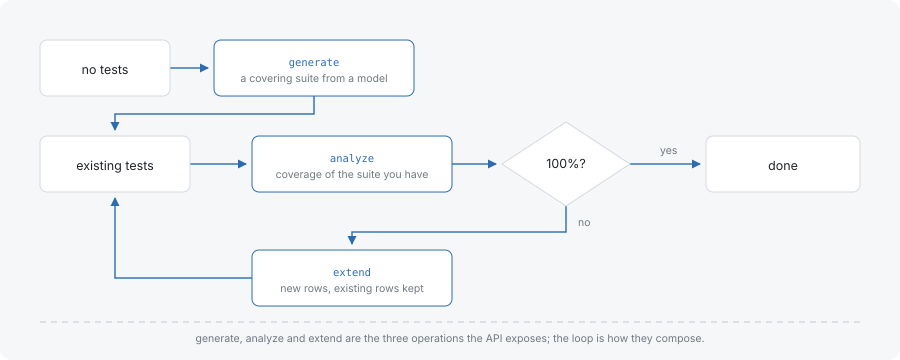

# Use cases

These guides start from data an application already holds — a hand-written test suite, a pytest module that enumerates every combination — and end at a decision the reader has to make. They are not a feature tour. For a recipe per feature, see [Examples](../examples.md).

Each guide states the model it works from, shows what the engine returns for it, and shows the arithmetic behind every number, so each step can be checked by running it. For the vocabulary the guides use — tuple, coverage unit, covering array, strength — see the [Primer](../primer/index.md).

- [Audit an existing suite](audit-an-existing-suite.md) — measure a hand-written suite against a model, read what it misses, and find the rows the model does not recognise.
- [Close the gaps incrementally](close-the-gaps-incrementally.md) — keep the existing rows, append only what coverage needs, and confirm the result.
- [Replace a cross-product in pytest](replace-a-cross-product-in-pytest.md) — move a parametrized test from every combination to a covering set.

## The loop these guides run



Analysis, generation and extension are three views of one model, not three tools. Analysis says what a suite reaches; extension appends what it does not reach without touching what is there; a second analysis confirms the result against the same model. Generation from scratch is the same loop with an empty starting suite.

## The model the first two guides share

The first two guides audit and then extend the same suite, so they work from one model.

```typescript
const parameters = [
  { name: 'os',      values: ['Windows', 'macOS', 'Linux'] },
  { name: 'browser', values: ['Chrome', 'Firefox', 'Safari'] },
  { name: 'device',  values: ['phone', 'desktop'] },
];
const constraints = ['IF os = Windows THEN browser != Safari'];
```

Three parameters give three parameter pairs, and 3 × 3 + 3 × 2 + 3 × 2 = 21 value pairs at strength 2. That 21 is the denominator both guides report against. The constraint makes one of the pairs impossible, so under it the required universe is 20 rather than 21. The third guide starts from a pytest module instead and states its own model.

## Where to go next

- [Getting started](../getting-started.md) — install and run a first suite on every surface.
- [Primer](../primer/index.md) — tuple, coverage, strength and constraints, from the beginning.
- [Examples](../examples.md) — a short recipe per feature, for when the feature rather than the flow is the question.
- [JavaScript API](../js-api.md) — the reference for `generate`, `analyzeCoverage` and `extendTests`.
- [Glossary](../glossary.md) — one entry per concept, each naming the API that implements it.
