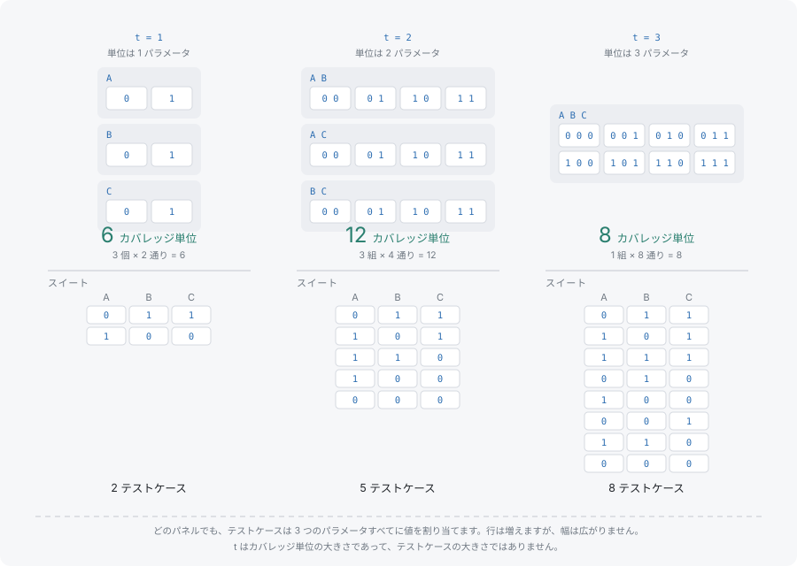

# 強度

**強度**（t と書きます）は、1 つのカバレッジ単位に含まれるパラメータの個数です。テストケースに含まれるパラメータの個数ではありません。どの強度でも、すべてのテストケースはすべてのパラメータに値を持ちます。t が決めるのは、どれくらいの大きさのグループから先をスイートが網羅的に覆わなければならないか、それだけです。このページは[タプルとカバレッジ](tuples-and-coverage.md)の数え方を前提とします。

## t が決めるもの、決めないもの



2 値のパラメータ A・B・C では、t を変えるとスイートが含むべきものは変わりますが、1 行の形は変わりません。

| t | A・B・C のカバレッジ単位 | 各テストケースが指定するもの |
|---|---|---|
| 1 | 6 個。各パラメータの各値を 1 回ずつ | A・B・C |
| 2 | 12 個。2 パラメータから取る値ペアすべて | A・B・C |
| 3 | 8 個。3 パラメータから取る値の 3 つ組すべて | A・B・C |

中央の列の計算は、どの t でも同じです。値を v 個ずつ持つパラメータが k 個のモデルでは、強度 t は、t 個のパラメータの選び方それぞれに、それらへの値の割り当てそれぞれを掛けた数だけ単位を要求します。すなわち C(k, t) · v^t です。ここでは t=1 で 3 · 2、t=2 で 3 · 4、t=3 で 1 · 8 になります。

このモデルでは t=3 の単位数が t=2 より少ないことに注意してください。3 つのパラメータから 3 つを選ぶ選び方が 1 通りしかないからです。単位が少ないことは行が少ないことを意味しません。t=2 の 12 単位は 4 行に収まりますが、t=3 の 8 単位には 8 行が要ります。1 行が持てる 3 つ組は 1 つだけだからです。

`strength` はモデルのフィールドで、既定値は 2 です。生成が目標とする集合と、カバレッジを測る対象の集合の両方を決めるので、生成と測定で同じ値を使う必要があります。3-wise のスイートを既定の強度で分析すると、そのペアだけを測って 100% と報告し、3 つ組については何も言いません。

## t=2 が試さずに残すもの

ペアワイズのスイートはペアについては完全で、それより大きいものについては沈黙します。前のページの 4 行のスイートを強度 3 で測ると、その沈黙の範囲がそのまま出ます。

```typescript
import { Coverwise } from '@libraz/coverwise';

const cw = await Coverwise.create();

const report = cw.analyzeCoverage(
  [
    { name: 'A', values: ['0', '1'] },
    { name: 'B', values: ['0', '1'] },
    { name: 'C', values: ['0', '1'] },
  ],
  [
    { A: '1', B: '1', C: '0' },
    { A: '0', B: '1', C: '1' },
    { A: '0', B: '0', C: '0' },
    { A: '1', B: '0', C: '1' },
  ],
  3,
);

report.totalTuples; // 8
report.coveredTuples; // 4
report.coverageRatio; // 0.5 (4 of 8 triples covered)
report.uncoveredCount; // 4 — including A=1, B=1, C=1
```

3 つ組の半分が欠けていて、そのうちの 1 つは全部が `'1'` の組み合わせです。A・B・C がすべて `'1'` のときにだけ出る不具合は、ペアワイズが完璧なスイートを生き延びます。これはスイートの欠陥ではありません。保証を、書いてある以上の意味で読んだだけです。

## 強度を上げるのが妥当な場面

対象システムの障害がより深い相互作用を必要とすると分かっている場合に t を上げます。3 つの設定が特定の組み合わせになったときだけ現れる不具合、独立した 3 つの選択肢からネゴシエートされるプロトコル、3 つのフラグで遷移が決まる状態機械などです。判断材料になるのは過去の障害です。再現に 3 つの特定の値を要した不具合は、その領域を t=3 にする根拠になります。

深いほうが安心だから上げる、というのは避けるべき理由づけです。t=3 は「ペアワイズをより良くしたもの」ではなく、別の、そしてはるかに大きい集合です。障害が単一またはペアで済んでいたパラメータについては、何も買い足していません。

深さが必要なのがモデルの一部だけなら、サブモデルを使えばそのグループにだけ独自の強度を与え、残りはペアワイズのままにできます。全体の t を上げるよりはるかに安く済みます。書き方は[実例集](../examples.md)にあります。

## 代償

C(k, t) · v^t の両方の項が t とともに増え、スイートの規模もそれに従います。3 パラメータのモデルでは t=3 が全組み合わせそのものです。t がパラメータ数と等しくなると、すべての単位を網羅するスイートは全組み合わせだけになります。

```typescript
import { Coverwise } from '@libraz/coverwise';

const cw = await Coverwise.create();

const result = cw.generate({
  parameters: [
    { name: 'A', values: ['0', '1'] },
    { name: 'B', values: ['0', '1'] },
    { name: 'C', values: ['0', '1'] },
  ],
  strength: 3,
});

result.stats.totalTuples; // 8
result.tests.length; // 8

for (const test of result.tests) {
  console.log(test);
}
// { A: '0', B: '1', C: '1' }
// { A: '1', B: '0', C: '1' }
// { A: '1', B: '1', C: '1' }
// { A: '0', B: '1', C: '0' }
// { A: '1', B: '0', C: '0' }
// { A: '0', B: '0', C: '1' }
// { A: '1', B: '1', C: '0' }
// { A: '0', B: '0', C: '0' }
```

パラメータがもっと多いモデルでは、全組み合わせは依然として手が届かないままで、カバリング配列は手が届きます。それでも t を 1 つ進めるごとにスイートは急に大きくなり、生成時間もそれに伴って伸びます。[パフォーマンス](../performance.md)には t=2 から t=6 までの実測のタプル数・スイート規模・所要時間が載っています。高い強度に踏み切る前に読む表はそれです。

## 次に読むもの

- [制約と必要タプル集合](constraints-and-the-universe.md) — どの単位が要求されるかを変える、もう 1 つの要因
- [パフォーマンス](../performance.md) — 現実的な規模のモデルでの、各強度の実測コスト
- [実例集](../examples.md) — サブモデル。重要なグループだけを 3-wise にし、残りをペアワイズのままにする書き方
- [入力上限](../limits.md) — どの強度にも効く、パラメータ数・値数・行数の上限
