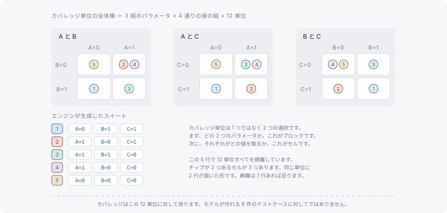

# タプルとカバレッジ

このページでは、カバリング配列が網羅する対象を、手で確かめられる大きさのモデルの上で数えます。[組み合わせテストとは](what-is-combinatorial-testing.md)を前提とします。削減したスイートは性質で定義されている必要がある、というのがそこでの結論でした。ここでは、その性質に正確な言い方を与えます。

## タプルとは何か

**タプル**とは、異なる t 個のパラメータそれぞれから 1 つずつ値を取った組み合わせです。t = 2 でパラメータが `os` と `browser` なら、`(os=Windows, browser=Chrome)` が 1 つのタプルです。タプルはパラメータの一部だけを、それぞれ高々 1 回ずつ指定します。**テストケース**はすべてのパラメータを指定します。

**カバレッジ単位**とは、スイートが含むことを要求されるタプルです。制約のないモデルを強度 t で見るとき、カバレッジ単位はそのモデルが作れるタプルすべて、すなわち**必要タプル集合**になります。カバレッジはそこから数える問題になります。それらの単位のうち、少なくとも 1 つのテストケースに現れるものはいくつか、という問題です。

このページで以降使うモデルは、値を 2 つずつ持つ 3 つのパラメータ A・B・C です。値はそれぞれ `'0'` と `'1'` です。

## 単位の数え方



数え方は 2 段階で、この 2 つを混同するのが最初のつまずきどころです。まずパラメータを選びます。A・B・C からパラメータのペアは 3 通り、A と B、A と C、B と C です。次に値を選びます。そのペアそれぞれに 2 × 2 = 4 通りの値の組み合わせがあります。パラメータのペア 3 通りに値の組み合わせ 4 通りで、カバレッジ単位は 12 個です。

ブロックの横に描かれている行は、このモデルに対して既定のシードが生成する 5 行です。同じ 12 個の単位を 4 行で網羅するスイートは、このページの後半に出てきます。

この数はモデルと強度だけで決まり、どんなスイートにも依存しません。レポートが `totalTuples` と呼んでいるのがこの数で、coverwise が出力するすべてのカバレッジ値の分母になります。

## すべての単位を網羅するカバリング配列

12 個の単位は 4 ケースに収まります。全組み合わせの 8 ケースより少ない行数です。

```typescript
import { Coverwise } from '@libraz/coverwise';

const cw = await Coverwise.create();

const result = cw.generate({
  parameters: [
    { name: 'A', values: ['0', '1'] },
    { name: 'B', values: ['0', '1'] },
    { name: 'C', values: ['0', '1'] },
  ],
  seed: 1,
});

result.stats.totalTuples; // 12
result.tests.length; // 4
result.coverage; // 1

for (const test of result.tests) {
  console.log(test);
}
// { A: '1', B: '1', C: '0' }
// { A: '0', B: '1', C: '1' }
// { A: '0', B: '0', C: '0' }
// { A: '1', B: '0', C: '1' }
```

任意の 2 列を選んで 4 行を読み下すと、そのペアの 4 通りの値の組み合わせがすべて現れます。各行は 12 個の単位のうち 3 個を同時に持ちます。12 個の単位が 4 行に収まるのはそのためです。1 行が、その行の持つ A-B ペア、A-C ペア、B-C ペアを同時に網羅します。

このモデルでは 4 が最小でもあり、ここでそこに届くにはシードが必要でした。coverwise は貪欲法でスイートを構成し、最小のものを探索はしません。既定のシードではこのモデルは 5 行になり、4 行のスイートも 5 行のスイートも、どちらも完全なカバリング配列です。保証するのは正しさであって、行数は近似です。シードが何を固定し何を固定しないかは[決定性](../determinism.md)を参照してください。

## カバレッジ率

**カバレッジ率**は、網羅済みの単位を必要な単位で割った値です。`generate` は `coverage`、`analyzeCoverage` は `coverageRatio` として報告します。どちらもジェネレータとは独立に単位を列挙して測るので、手で書いたスイートに対しても同じように成り立ちます。

```typescript
import { Coverwise } from '@libraz/coverwise';

const cw = await Coverwise.create();

const report = cw.analyzeCoverage(
  [
    { name: 'A', values: ['0', '1'] },
    { name: 'B', values: ['0', '1'] },
    { name: 'C', values: ['0', '1'] },
  ],
  [{ A: '0', B: '0', C: '0' }],
);

report.totalTuples; // 12
report.coveredTuples; // 3 (one row holds one unit per parameter pair)
report.coverageRatio; // 0.25 (3 of 12 units covered)
report.uncoveredCount; // 9
```

1 未満の率は、点数ではなく一覧です。欠けていると数えられた単位はすべて、それを構成するパラメータと値とともに `uncovered` に報告されるので、穴には名前が付き、行を足せば埋められます。`uncovered` は診断用の上限で打ち切られ、`omittedUncovered` が省かれた件数を示すので、配列は常にちょうど `uncoveredCount - omittedUncovered` 件を保持します。

## 次に読むもの

- [強度](strength.md) — パラメータのペアが 3 通りで、3 つ組が 4 通りではないと決めていた t の話
- [制約と必要タプル集合](constraints-and-the-universe.md) — 組み合わせを禁止すると分母から単位が減る仕組み
- [JavaScript API](../js-api.md) — `GenerateResult` と `CoverageReport` の全体像
- [用語集](../glossary.md) — タプル、カバレッジ単位、カバリング配列、カバレッジ率の、それ単体での定義
