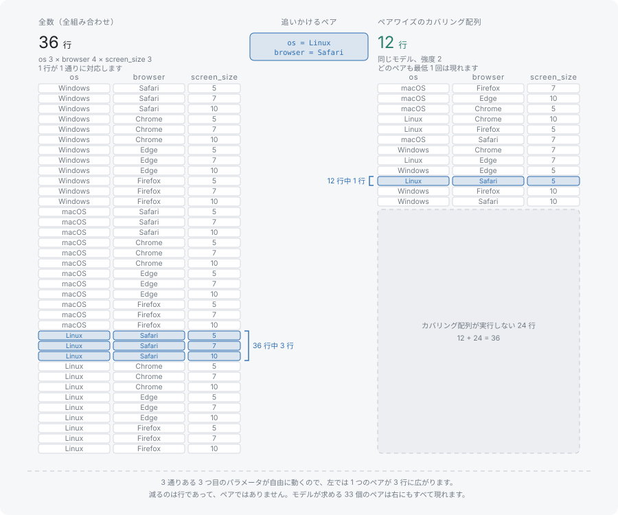

# 組み合わせテストとは

**組み合わせテスト**とは、テストケースを本数や勘で選ぶのではなく、対象システムのパラメータについて明示した網羅の性質から選ぶやり方です。入力空間の無作為抽出ではありませんし、既存のスイートを縮める経験則でもありません。スイートは性質から構成され、できあがったスイートについて成り立つのはその性質です。

## 全組み合わせの多さ

パラメータが 3 つあるモデルを考えます。値が 3 つの OS、値が 4 つのブラウザ、値が 3 つの画面サイズです。全組み合わせを試すなら 3 × 4 × 3 = 36 ケースになります。1 つの機能のために手で流す本数としてはすでに多く、しかもこれは意味のある例のなかで最小の部類です。

この数は積なので、掛け算で増えます。値が 3 つのパラメータをもう 1 つ足せば全組み合わせは 108 です。値が 3 つのパラメータが 10 個なら 59,049 通りになります。モデルが現実的でなくなるよりずっと手前で、全組み合わせのテストは選択肢でなくなります。

つまり現実のスイートは常に部分集合です。そして、どの部分集合であるかが、そのスイートについて何を主張できるかを決めます。

## 無作為な部分集合が残す、名前を付けられない穴

36 行から無作為に 12 行を選べば、本数としては説明のつくスイートになりますが、中身の説明はつきません。テストしているのは 12 通りの組み合わせです。Firefox を Linux で動かしたか、大画面と Edge を組み合わせたかは、行を読まないと答えられません。テストが通ったとき何を否定できたのかは、そもそも答えられません。

同じ指摘は、手で書かれて成り行きで増えたスイートにも当てはまります。規模が大きくても特定のペアを一度も試していないことがあり、それがどのペアなのかを、スイート自身は示しません。

役に立つ削減は、集合全体について成り立つ性質で定義されている必要があります。そうして初めて、テストが通ったことがその性質を立証します。

## 保証で定義された部分集合としてのカバリング配列



**カバリング配列**とは、任意の 2 つのパラメータから取った値の組み合わせがすべて、少なくとも 1 行に現れるテストケースの集合です。定義は行数ではなくこの性質のほうです。行数は、その性質を満たすのにかかっただけの数になります。

```typescript
import { Coverwise } from '@libraz/coverwise';

const cw = await Coverwise.create();

const result = cw.generate({
  parameters: [
    { name: 'os',      values: ['Windows', 'macOS', 'Linux'] },
    { name: 'browser', values: ['Chrome', 'Firefox', 'Safari', 'Edge'] },
    { name: 'screen',  values: ['small', 'medium', 'large'] },
  ],
});

result.tests.length; // 12
result.stats.totalTuples; // 33 (12 os-browser pairs + 9 os-screen + 12 browser-screen)
result.coverage; // 1

for (const test of result.tests) {
  console.log(test);
}
// { os: 'macOS', browser: 'Edge', screen: 'medium' }
// { os: 'macOS', browser: 'Safari', screen: 'large' }
// { os: 'macOS', browser: 'Firefox', screen: 'small' }
// { os: 'Linux', browser: 'Firefox', screen: 'large' }
// { os: 'Linux', browser: 'Edge', screen: 'small' }
// { os: 'macOS', browser: 'Chrome', screen: 'medium' }
// { os: 'Windows', browser: 'Firefox', screen: 'medium' }
// { os: 'Linux', browser: 'Safari', screen: 'medium' }
// { os: 'Windows', browser: 'Safari', screen: 'small' }
// { os: 'Linux', browser: 'Chrome', screen: 'small' }
// { os: 'Windows', browser: 'Edge', screen: 'large' }
// { os: 'Windows', browser: 'Chrome', screen: 'large' }
```

36 行のうちの 12 行が、33 通りの値ペアをすべて持っています。どの行も全組み合わせの行と同じようにすべてのパラメータに値を持ちます。削減が取り除いたのは、他の行がすでに網羅しているペアの重複です。任意の 2 つのパラメータと、その 2 つの任意の値を選べば、両方を持つ行がスイートの中にあります。

この主張は検証できます。カバレッジはジェネレータとは独立にタプルを列挙して測るからです。測定を、行を作ったコードから切り離している理由は[FAQ と制限](../faq.md)にあります。[タプルとカバレッジ](tuples-and-coverage.md)では、目で確かめられる大きさのモデルでこの数え方をたどります。

## ペアが既定である理由

ペアを網羅するのは 1 つの選択であり、その根拠は経験的なものです。複数の分野の不具合報告を調べた研究では、障害の大半は 1 つのパラメータ単独か、2 つのパラメータが同時に作用したときに起きており、3 つ以上を要するものは尾を引きながら減っていくと報告されています。coverwise がペアを既定にしているのはそのためです。

これは調査対象となったシステムについての経験的事実であって、個々のシステムについての定理ではありません。ペアワイズが保証するのはただ 1 つ、どの値ペアもどこかに現れるということだけです。3 つの値が同時に揃ったときだけ出る不具合については何も言いませんし、そうした不具合は実在します。既知の障害がより深い相互作用を必要とする場合、効くのは同じ種類の行を増やすことではなく強度のほうです。[強度](strength.md)では、ペアワイズのスイートが試さずに残すものを実測し、t を上げる代償を示します。

## 次に読むもの

- [タプルとカバレッジ](tuples-and-coverage.md) — 網羅の対象となる単位と、2 値 3 パラメータのモデルでの数え方
- [強度](strength.md) — 「ペアワイズ」の 2 が実際に決めているものと、変更すべき場面
- [はじめかた](../getting-started.md) — サーフェスを入れて上の例を実行する手順
- [パフォーマンス](../performance.md) — より大きなモデルでの実測のスイート規模と生成時間
