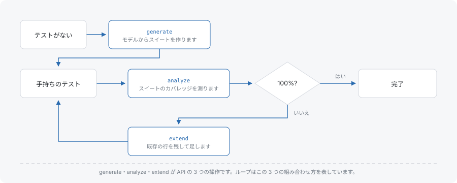

# ユースケース

これらのガイドは、アプリケーションがすでに持っているデータから始まります。手書きのテストスイート、全組み合わせを列挙する pytest モジュールなどです。そして読み手が下すべき判断で終わります。機能の紹介ではありません。機能ごとのレシピは[実例集](../examples.md)を参照してください。

各ガイドは、扱うモデルを明示し、エンジンがそのモデルに対して返す値を示し、すべての数値の内訳を示します。どの手順も、実際に動かして確かめられます。ガイドが使う語彙、すなわちタプル、カバレッジ単位、カバリング配列、強度については[入門](../primer/index.md)を参照してください。

- [既存スイートを監査する](audit-an-existing-suite.md) — 手書きのスイートをモデルに対して測り、何が抜けているかを読み、モデルが認識できない行を見つけます。
- [不足を少しずつ埋める](close-the-gaps-incrementally.md) — 既存の行をそのまま残し、カバレッジに必要な分だけ追加し、結果を確認します。
- [pytest の全組み合わせを置き換える](replace-a-cross-product-in-pytest.md) — 全組み合わせを回すテストを、網羅に足りる集合へ移します。

## ガイドが回すループ



解析・生成・拡張は 3 つのツールではなく、1 つのモデルに対する 3 つの見方です。解析はスイートが到達している範囲を示します。拡張は、到達していない範囲を、既存の行に触れずに追加します。2 回目の解析は、同じモデルに対して結果を確認します。ゼロからの生成は、開始スイートが空の場合の同じループです。

## 最初の 2 つのガイドが共有するモデル

最初の 2 つのガイドは同じスイートを監査してから拡張するので、1 つのモデルを共有します。

```typescript
const parameters = [
  { name: 'os',      values: ['Windows', 'macOS', 'Linux'] },
  { name: 'browser', values: ['Chrome', 'Firefox', 'Safari'] },
  { name: 'device',  values: ['phone', 'desktop'] },
];
const constraints = ['IF os = Windows THEN browser != Safari'];
```

パラメータが 3 個なのでパラメータの組は 3 通りあり、強度 2 での値のペアは 3 × 3 + 3 × 2 + 3 × 2 = 21 個です。この 21 が、どちらのガイドでも分母になります。制約はそのうち 1 個を不可能にするため、制約のもとでの必要タプル集合は 21 ではなく 20 になります。3 つ目のガイドは pytest モジュールから始まるので、独自のモデルを示します。

## 次に読むもの

- [はじめかた](../getting-started.md) — インストールと、各サーフェスでの最初のスイート生成
- [入門](../primer/index.md) — タプル、カバレッジ、強度、制約を最初から扱うページ
- [実例集](../examples.md) — 機能ごとの短いレシピ。流れではなく機能そのものが知りたいときに読むページ
- [JavaScript API](../js-api.md) — `generate`、`analyzeCoverage`、`extendTests` のリファレンス
- [用語集](../glossary.md) — 1 概念 1 項目。各項目はそれを実装する API 付き
